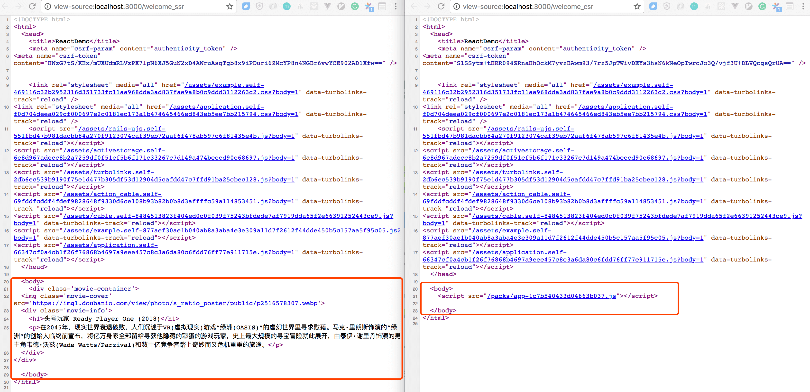
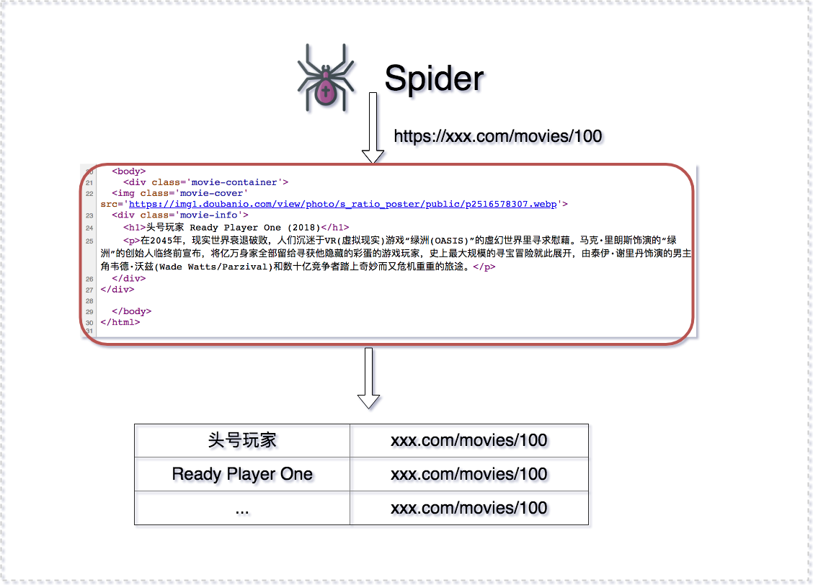
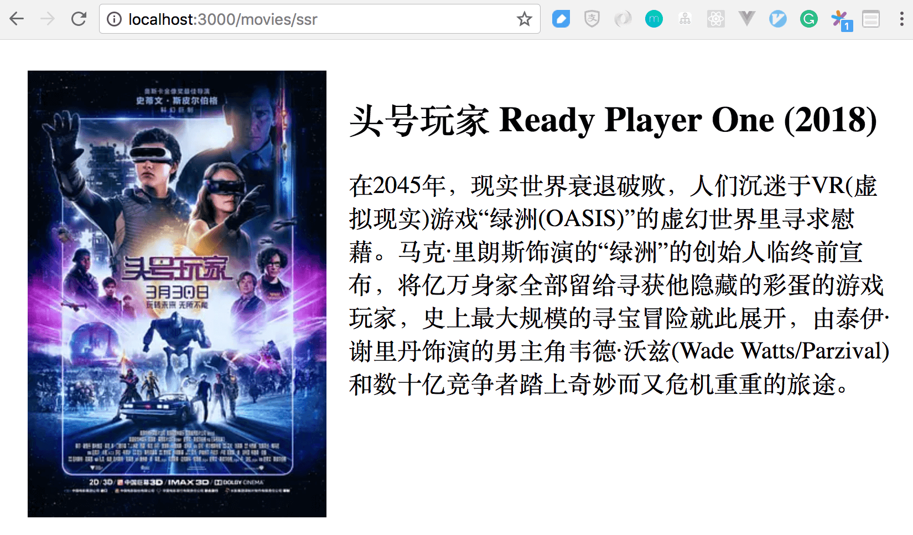
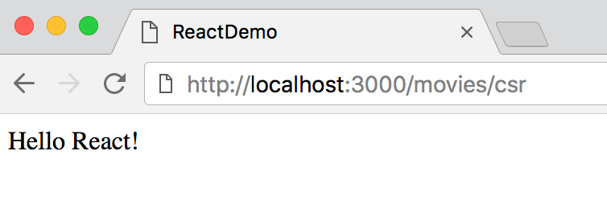
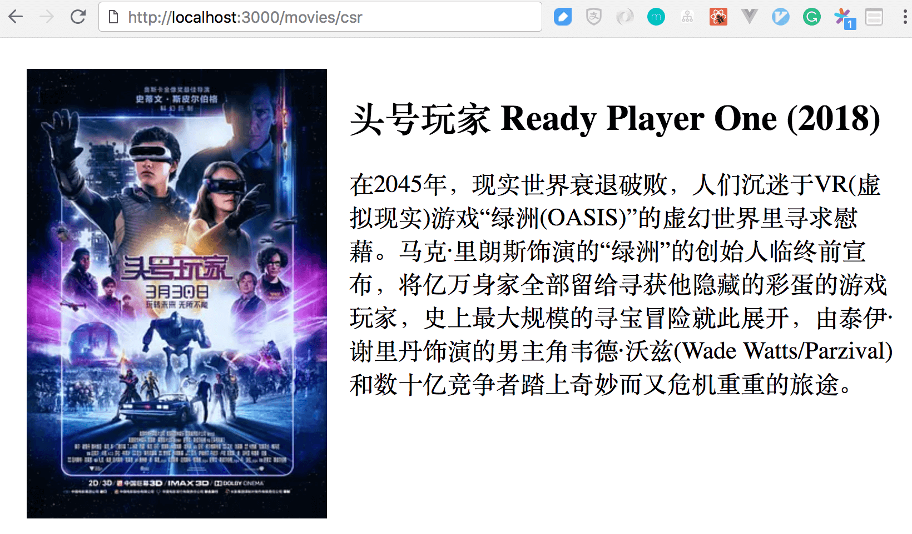
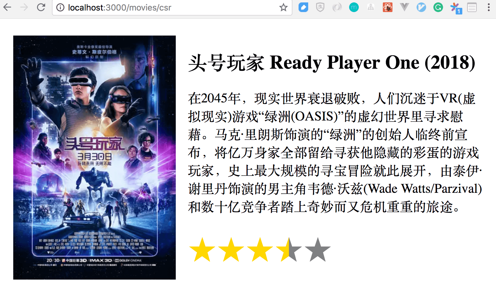
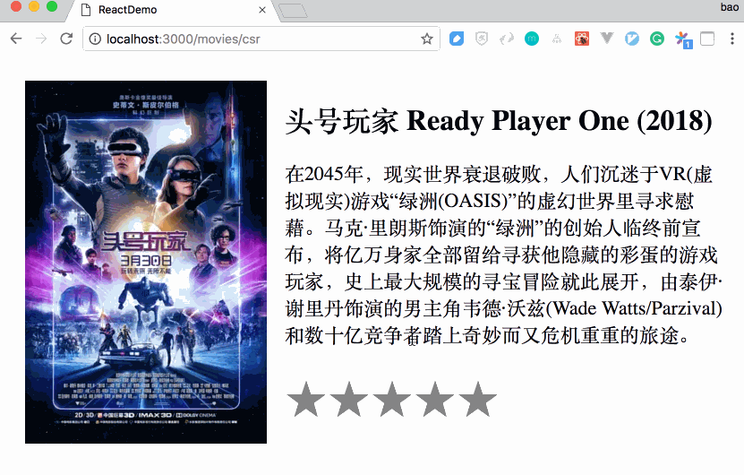
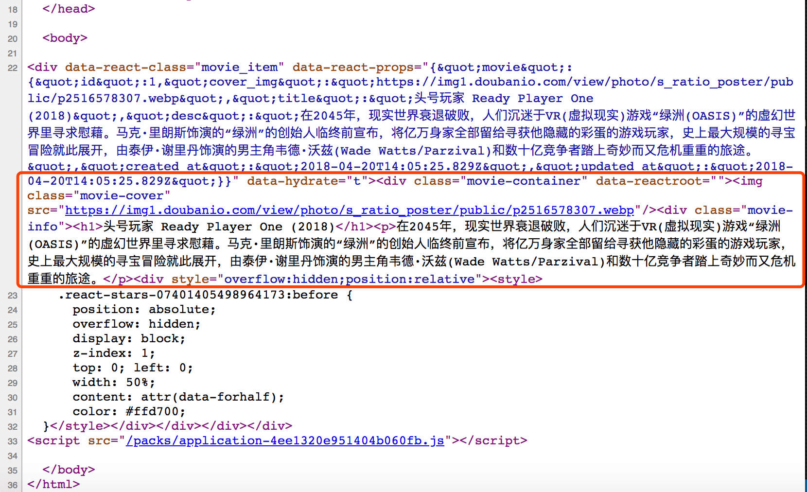

# 在 Rails 中使用 React 并实现 SSR 的一种实践

## 背景

这是我在公司内部所做的一次分享 (听众也有 PM，所以讲的内容不会很深入)。先说说背景，我为什么要做这次分享。

主要是我在一个 rails 项目中使用了 react 去渲染前端页面，且支持 SSR，但没有做前后端分离，想把一些经验做一些总结，以便将来也许可以用到其它项目中。

项目的具体内容在此略过。

这个项目刚开始做的时候，其实是一个很传统的 rails web 项目，前端页面在服务端通过 html 模板生成。

但是，做了一段时间后，客户有一些想法了：

1. 要用 react 来渲染前端页面，可能是因为他们觉得 react 很 cool 吧，而且当时在国外正流行。(没错，这是一个国外项目)
1. 必须支持 SEO (Search Engine Optimization)。(因为这是一个内容型网站)

我们知道，react 是一个客户端渲染 (Client Side Rendering, CSR) 的前端框架 (或者说是库)，但是如果我们要支持 SEO 的话，意味着同时必须做服务端染渲 (Server Side Rendering, SSR)。

方法之一，就是做前后端分离，把 rails 代码改造成只提供 API，然后在前面加一个 Node 的中间层做同构，可以用 Next.js 或 Express/Koa。

但当时的情况是，没有前后端分离的经验，也没做过 react 的服务端渲染，最重要的是，时间不够我们做这么大的改变。

所幸的是，经过短暂的调研，发现一个叫 [react-rails](https://github.com/reactjs/react-rails) 的 gem (当时的版本还是 1.10) 可以快速地满足我们的需求，支持在 rails 中使用 react，支持 SSR，且不需要前后端分离。

用法大概是这样子的。以我们后面要实现的页面为例，假设我们有一个显示电影信息的页面。

传统的 rails 代码是这样的：

    class MoviesController < ApplicationController
      def show
        @movie = Movie.find params[:id]
        # render 'show'
      end
    end

    # show.html.erb
    

      >
      

        <h1><%= @movie.title%></h1>
        
<%= @movie.desc %>

      

    

在 action 中从数据库取数据，然后再去 render html 模板。

用了 react-rails 后，在 action 中就不再是去 render html 模板，而是 render 一个 react component。代码如下：

    class MoviesController < ApplicationController
      def show
        @movie = Movie.find params[:id]
        render component: 'MovieItem',
               props: {
                 movie: @movie
               }
      end
    end

    # movie_item.jsx
    class MovieItem extends React.Component {
      render() {
        const { movie } = this.props
        return (
          

            
            

              <h1>{movie.title}</h1>
              
{movie.desc}

            

          

        )
      }
    }

或者另一种做法是，不修改 show action 的代码，还是让它渲染 show.html.erb，但在 show.html.erb 中删掉原来的模板，使用 react-rails 提供的 `react_component` view helper 方法来渲染 MovieItem component，如下所示：

    # show.html.erb
    <%= react_component('MovieItem', {movie: @movie}, {prerender: true}) %>

两者的区别是，前者默认做 SSR，即 `{prerender: true}`，后者可以通过第三个参数来选择做 SSR 还是不做 SSR，如果 prerender 为 false，则不做 SSR。

其原理是，当执行到 `react_component` 方法时，如果 prerender 为 false，就会简单地生成一个空的 div 标签，它包含 data-react-class 和 data-react-props 两个属性，前者用来存放要要渲染的 component 的名字，后者存放此 component 的 props。生成的 html 如下所示：

      <body>
    

      </body>

浏览器得到此 html，执行其中的 js 代码 (在 head 中引入)，js 代码可以从 data-react-class 和 data-react-props 属性中得知要渲染的 component 以及其 props，因此创建相应的 MovieItem component，并向其传递从 data-react-props 中解析得到的 props，调用其 render() 方法进行渲染。

如果 prerender 为 true，rails 会调起一个 JavaScript 的环境来把 MovieItem 的 render() 方法在服务器端先执行一遍，生成相应的 html 标签并返回给浏览器，生成的 html 如下所示：

      <body>

    

<h1>头号玩家 Ready Player One (2018)</h1>
在2045年，现实世界衰退破败，人们沉迷于VR(虚拟现实)游戏“绿洲(OASIS)”的虚幻世界里寻求慰藉。马克·里朗斯饰演的“绿洲”的创始人临终前宣布，将亿万身家全部留给寻获他隐藏的彩蛋的游戏玩家，史上最大规模的寻宝冒险就此展开，由泰伊·谢里丹饰演的男主角韦德·沃兹(Wade Watts/Parzival)和数十亿竞争者踏上奇妙而又危机重重的旅途。

      </body>

这种情况下，浏览器直接就可以把内容先展示出来，然后当 js 代码执行时，创建 MovieItem component 后，会再次执行 render() 方法，把这部分内容重新渲染一遍，但用户是感知不出来的。(具体实现的细节还有待探索)

所以，做 SSR 和不做 SSR 的区别之一是，做 SSR 时，因为 render() 方法首先会在服务端被执行一次，所以不能在 render() 方法中调用到任何浏览器相关的 API，比如 `window.location.href`，必须把它移到 componentDidMount() 中去调用。componentDidMount() 方法只会在浏览器端组件被加载后调用，在服务端不会被调用。

但是，可以从上面的代码看到，用 react-rails 后，不管做不做 SSR，我们需要渲染的数据都是直接在服务端获得的，并没有在客户端去发 ajax 请求拿数据的逻辑，所以并没有前后端分离。在这里，我们仅仅是用 react component 去替代了原来的 html 模板，渲染 props 传过来的数据，实现了 React 所宣称的它只是一个很薄的 view 层。

所以，借助 react-rails 后，我们的工作就简单多了，就是把一个个 html 模板替换成 react component，什么 redux，react-router，统统都没去用。

相比传统的 html 模板渲染，react component 的 SSR 渲染可能效率会低一些，毕竟要再起一个 JavaScript 环境去做这个事情。

但相比写传统的 html 模板代码，我还更愿意也更擅长写 react 代码，心里还是美滋滋的。

但是，此时的 react-rails 有一个大坑，从上面 MovieItem 的实现也可以看出，它没有 export，因为每一个 react component 默认都是全局可见的，也没有 import，因为它压根就不能使用 npm 包，因此也没有一个 package.json 的文件。

这意味着，我们必须要自己手动实现每一个 component。这很让人头疼，也是我做这个项目时心头一直的一个痛。就担心哪天要实现一个很复杂的组件，就不知道该怎么办了。

但直到上个月，都一直还 OK，大部分组件都不是很复杂，还能 hold 得住，如果有别人实现过的组件，比如 star rating，auto size textarea，就参考别人的实现，把别人的代码翻译简化一下，不复杂的就自己实现，比如 collapse。

直到有一天，我们的设计稿上出现了一个 range slider，略复杂，网上也找到了几乎一样的实现 - [rc-slider](http://react-component.github.io/slider/examples/handle.html)，看了一下它的源码，首先，源码就很复杂，然后它又依赖了 rc-tooltip 等一堆 npm 包，这完全 copy 不动啊... 我们也承担不起花费很多时间去重新实现这么一个组件。

所以我们就开始思考怎么来彻底解决这个痛 - 在 rails 中使用 npm 包。

好消息是，在今天，这个方法并不难 (借助 webpacker)，但在一年多前，我们刚开始使用 react-rails 的时候，那时候还是一个难点。react-rails 中的有一些讨论如何使用第三方库的 issue：

- [How do you require react-modal in your app?](https://github.com/reactjs/react-rails/issues/510)
- [How do you manage dependencies?](https://github.com/reactjs/react-rails/issues/135)

有一些 workaround，比如使用 rails assets gem，或者将第三方库编译后的代码放到 app/assets/javascripts/vendor 目录下 ... 但都不是很完美的解决方案。[browserify-rails](https://github.com/browserify-rails/browserify-rails) 是最近才知道的，但有了 webpacker 后就没有研究了。

[去年 rails 5.1 在发布时](https://ruby-china.org/topics/32374)，同时发布了一个叫 [webpacker](https://github.com/rails/webpacker) 的 gem，把前端的打包工具 webpack 整合进 rails，有了它，我们就可以方便地在 rails 中使用各种前端框架，react / vue / angular / stimulus ... 和使用 npm 包。

新版本的 react-rails (2.4.4) 也可以很好地和 webpacker 配合使用，因此果断地将 react-rails 从 1.10 升级到 2.4.4，并引入 webpacker。

当然，升级过程总是痛苦的，踩了各种坑，花了好几天才升级完毕。react-rails 的错误信息提示是个大问题，如果一个组件里面包裹了多层子组件，最里面的子组件写错了，它只会说最外层组件出错了，你不知道具体错在哪，只能一层一层排除。错误信息也不够明确，路径写错了，是 "Element tyep is invalid"，变量重复定义，也是这个错，什么有价值的信息也没有，不会告诉你是哪个文件找不到，哪个变量重复定义。吐槽一下。

    Encountered error "#<ExecJS::ProgramError: Invariant Violation: Element type is invalid: expected a string (for built-in components) or a class/function (for composite components) but got: undefined. You likely forgot to export your component from the file it's defined in, or you might have mixed up default and named imports.>" when prerendering HelloWorld with {"greeting":"Hello"}

升级改造完成后，`yarn install rc-slider`，改改样式，range slider 就搞定了，一个心头的痛总算是搞定了。

总结就是，webpacker 支持我们在 rails 中使用 npm 包和 react，react-rails 支持对 react 做 SSR。

以上就是背景，接下来终于要进入主题，以下是我要讲的内容提纲。

## Content Table

1. What's SSR (server side rendering) & CSR (client side rendering), comparison
1. What's SEO (search engine optimization), How search engine works
1. CSR's drawbacks (SEO not friendly & blank first screen)
1. Demo webpacker to support use react in rails
   - Setup webpacker
   - Implement SSR / CSR examples (MoviesController)
1. Demo use third party npm packages (react-stars)
1. Demo blank first screen and workaround (loading status)
1. Demo react-rails to support SSR for react
1. Summary

(当初准备的是英文分享，这部分就懒得翻译了)

前面两小节是用来给 PM 普及一下基础知识，开发人员可以略过。

## SSR & CSR

首先，我准备了一个 demo，展示两个简单的页面，一个是传统的 SSR 页面，一个是 CSR 页面。

它们在浏览器中看上去是一模一样，实际也确实如此。

但这只是表面现象，我们要透过现象看本质，来看一下它们的源码。

左侧的 SSR 页面，源码 body 中的内容，和我们在浏览器中看到的是一样的，这些内容在服务器就生成好了。

而右侧的 CSR 页面，源码 body 中除了一个 js 文件，空空如也，那浏览器中我们看到的 img, h1, p 是从哪来的呢，那很明显只能是由 js 代码在客户端这边生成的了。

所以，前者就是所谓的服务端渲染，html 中的内容主要在服务端生成；而后者就是客户端渲染，html 中的内容主要在客户端生成。

## SEO

SEO 是 search engine optimization 的缩写，意为搜索引擎优化，意思是说，如何优化你的网页内容或结构，当用户搜索相关的关键字时，能使我们的网页在搜索结果中排得越前，这样我们就能获得更多的流量。这其实是一门挺大的学问。

那搜索引擎到底是怎么工作的呢，为什么我们在 Google 中搜索一些关键字，就能找到相关的网页呢。

这是因为每一个搜索引擎都有自己的 spider，即网络爬虫，这些爬虫不停地在爬取全世界所有的网页，然后解析和提取其中的文本内容，然后存到自己的数据库中。

需要注意的一点是，spider 不会去执行网页上的 js 代码，它完全不关心 js 代码和 css 样式。

让我们来对比一下 spider 是如何解析 SSR 页面和 CSR 页面的。

从上面的对比可以看出，CSR 页面对 SEO 是不友好的，因为 spider 无法从中得到有效的信息，抽取不出什么关键字，因此我们无法通过搜索引擎检索到这个网页。

一般来说，内容型的网页需要关心 SEO，比如 blog 类，新闻类网站。而另外一些则可以完全不用考虑 SEO 的问题，尤其是需要登录访问的网站，比如后台管理，论坛，社交网站 ...

另外，补充一下，还有一类网页，可能对 SEO 没有需求，但是也必须做 SSR。如果你做过将网页分享到 Facebook 的话，你会发现，Facebook 会通过它的 crawler 去爬取当前网页，并从 head 部分的 meta 标签中提取出要分享的内容，比如 url, title, description, image ... ([A Guide to Sharing for Webmasters](https://developers.facebook.com/docs/sharing/webmasters#markup))

## CSR 的缺点

主要有两个缺点，一是对 SEO 不友好，前面已经解释了。其二是首屏白屏的问题。

我同样准备了一个 demo，先让大家大致对这个首屏白屏现象有个体会。假设我们服务端的程序性能很差，从数据库查询数据要很久，我们用 sleep 5s 来模拟这种情况，然后来对比一下访问 SSR 页面和 CSR 页面的感受，和所观察到的现象。

两者的对比是很明显的，对于 SSR 页面的访问，在浏览器上有一个长达数秒的 loading 状态，表明还在从服务器下载网页中，只要一下载回来，网页内容就会马上显示，但在显示之前，网页内容是保持不变的。

对于 CSR 页面的访问，从服务器下载网页倒是很快，因为浏览器几乎没有 loading 状态，但下载回来后，js 再发 ajax 请求去获取数据，在数据回来之前，这中间有一个长达数秒的白屏现象。这给用户造成了一定的困扰，体验很不好。

这就是所谓的首屏白屏现象，我们后面会讲到如何来解决这个问题。

## Demo webpacker to support use react in rails

### Setup webpacker

OK，前面讲了一些理论，接下来我们终于可以开始来进行一些实战了。我们的目标就是来一步一步实现前面展示的两个页面，一种用传统的 SSR 来实现，一种用 react 的 CSR 来实现，进行对比，最后再对后者进行 SSR。

首先，我们创建一个新的 rails 项目。

    $ rails new react-demo
    $ cd react-demo

然后，我们根据 webpacker 的文档，把 webpacker 安装并配置好。

第一步是在 Gemfile 里声明 webpacker gem。

    # Gemfile
    gem 'webpacker', '~> 3.4'

然后执行 bundle 安装。

接着，执行 `bin/rails webpacker:install` 命令，这个命令会生成很多 webpack 的配置文件，我们暂时不用关心，用默认配置就行，如果想要定制的话，那还得先去学学 webpack。

需要关心的是，这个命令直接在 app 目录层级下创建了 javascript/packs 目录，我们的 js 代码就放在这里，而不像以前是放在 app/assets/javascripts 目录下。从目录层级来看，它相当于提升了一层，不再是和 images / css style 一起作为 assets 看待，而是和 controllers / models 一个层级。

另外，生成的文件还有 package.json，有了这个文件的出现，意味着我们就可以开始自由地使用 npm 包了。

webpacker 是支持多种前端框架的，比如 react / vue / angular / stimulus / elm 等等，在这里，我当然选择使用 react 啦。

所以，我们接着执行 `bin/rails webpacker:install:react` 引入 react。

执行这个命令后，可以看到 package.json 中就增加了对 react，react-dom 依赖了，同时在 .babelrc 中增加了对 react 的支持，这样 babel 就能转换 jsx 语法了。

    // package.json
    "name": "react-demo",
    "private": true,
    "dependencies": {
      "@rails/webpacker": "3.4"
      "@rails/webpacker": "3.4",
      "babel-preset-react": "^6.24.1",
      "prop-types": "^15.6.1",
      "react": "^16.3.2",
      "react-dom": "^16.3.2"
    },

同时生成了一个 react component 示例，在 app/javascript/packs/hello_react.jsx 中，稍候我们会讲如何把它展示出来。

### Implement SSR / CSR example

#### Create Movie model

我们想要显示电影信息的页面，所以我们先来创建一个 Movie model，设置 `cover_img`, title, desc 三个属性。

    $ bin/rails g model Movie cover_img:string title:string desc:text
    $ bin/rails db:migrate

接着，我们给这个 movies 表填充点数据，我们修改 db/seeds.rb 文件。

    # db/seeds.rb
    # movie data comes from movie.douban.com
    Movie.create([
      {
        cover_img: 'https://img1.doubanio.com/view/photo/s_ratio_poster/public/p2516578307.webp',
        title: '头号玩家 Ready Player One (2018)',
        desc: '在2045年，现实世界衰退破败，人们沉迷于VR(虚拟现实)游戏“绿洲(OASIS)”的虚幻世界里寻求慰藉。马克·里朗斯饰演的“绿洲”的创始人临终前宣布，将亿万身家全部留给寻获他隐藏的彩蛋的游戏玩家，史上最大规模的寻宝冒险就此展开，由泰伊·谢里丹饰演的男主角韦德·沃兹(Wade Watts/Parzival)和数十亿竞争者踏上奇妙而又危机重重的旅途。'
      },
      {
        cover_img: 'https://img1.doubanio.com/view/photo/s_ratio_poster/public/p2516914607.webp',
        title: '湮灭 Annihilation (2018)',
        desc: '莉娜（娜塔莉·波特曼 Natalie Portman 饰）是一名生物学家，一年前，她的丈夫凯恩（奥斯卡·伊萨克 Oscar Isaac 饰）在参加一项秘密任务后神秘失踪，这一年间，莉娜一直生活在悲伤之中。某天，失忆的凯恩忽然出现在了莉娜的面前，之后晕倒被送入了医院。在那里，莉娜遇见了文崔斯博士（詹妮弗·杰森·李 Jennifer Jason Leigh 饰）。'
      }
    ])

然后执行 `bin/rails db:seed` 填充数据。

进入 rails 控制台看一下数据是不是已经有了。

    $ bin/rails c
    2.3.3 :001 > Movie.all
      Movie Load (11.4ms)  SELECT  "movies".* FROM "movies" LIMIT ?  [["LIMIT", 11]]
    => #<ActiveRecord::Relation [#<Movie id: 1, cover_img: "https://img1.doubanio.com/view/photo/s_ratio_poste...", title: "头号玩家 Ready Player One (2018)", desc: "在2045年，现实世界衰退破败，人们沉迷于VR(虚拟现实)游戏“绿洲(OASIS)”的虚幻世界里寻求...", created_at: "2018-04-20 14:05:25", updated_at: "2018-04-20 14:05:25">, #<Movie id: 2, cover_img: "https://img1.doubanio.com/view/photo/s_ratio_poste...", title: "湮灭 Annihilation (2018)", desc: "莉娜（娜塔莉·波特曼 Natalie Portman 饰）是一名生物学家，一年前，她的丈夫凯恩（奥斯...", created_at: "2018-04-20 14:05:25", updated_at: "2018-04-20 14:05:25">]>

#### Create Movies controller

然后我们创建 Movies controller，并且为它生成 ssr 和 csr 两个 action。

    $ bin/rails g controller Movies ssr csr

至此，准备工作完毕。

#### Implement SSR page

我们首先用传统的 SSR 来实现一个显示电影信息的页面。我们让它显示 id 为 1 的 movie 信息。

修改 MoviesController 的 ssr action。

    class MoviesController < ApplicationController
      def ssr
        @movie = Movie.find 1
      end
      ...
    end

修改相应的 view 模板 ssr.html.erb。

    

      >
      

        <h1><%= @movie.title%></h1>
        
<%= @movie.desc %>

      

    

执行 `bin/rails s` 启动 rails，访问 `localhost:3000/movies/ssr`。

给它加点 css style，修改 app/assets/stylesheets/movies.scss 文件。

    .movie-container {
      display: flex;
      padding: 20px;

      .movie-info {
        margin-left: 20px;
        width: 600px;

        p {
          font-size: 22px;
        }
      }
    }

刷新一下再看效果，至此，一个 SSR 页面就完成了。

### Implement CSR page

我们前面说到，生成了一个示例 react component 文件 `hello_react.jsx`，我们来看一下它的内容。

    import React from 'react'
    import ReactDOM from 'react-dom'
    import PropTypes from 'prop-types'

    const Hello = props => (
      
Hello {props.name}!

    )

    Hello.defaultProps = {
      name: 'David'
    }

    Hello.propTypes = {
      name: PropTypes.string
    }

    document.addEventListener('DOMContentLoaded', () => {
      ReactDOM.render(
        <Hello name="React" />,
        document.body.appendChild(document.createElement('div')),
      )
    })

在这个文件中，定义了一个 Hello 的 component，并且监听 document 的 DOMContentLoaded 事件，在这个事件触发时，将创建一个 div 的 DOM element，把这个 element append 到 document.body 中，并且在这个 div element 中，渲染 Hello component。

我们只需要把这段 js 代码包含到 view 模板中，浏览器将会执行这段代码从而把 Hello component 展示出来。

我们修改 csr.html.erb，删掉原来的代码，让它仅仅包含 `hello_react.jsx` 的代码。我们知道有一个 `javascript_include_tag` 的 view helper 方法，它是用来引入 app/assets/javascripts 目录中的 js 文件，如果要引入 app/javascript/packs 目录下的 js 文件，我们使用 `javascript_pack_tag` view helper 方法。

    <%= javascript_pack_tag 'hello_react' %>

访问 `localhost:3000/movies/csr`，效果如下。

接下来，我们把这个默认的 Hello component 替换成我们自己定义的 MovieItem component。

我们创建一个新的文件 `movie_item.jsx`，实现 MovieItem component，代码如下。

    import React from 'react'
    import PropTypes from 'prop-types'

    export default class MovieItem extends React.Component {
      constructor(props) {
        super(props)

        this.state = {
          movie: null
        }
      }

      componentDidMount() {
        fetch('/movies/1')
          .then(res => res.json())
          .then(movie => this.setState({movie}))
      }

      render() {
        const { movie } = this.state
        if (movie) {
          return (
            

              
              

                <h1>{movie.title}</h1>
                
{movie.desc}

              

            

          )
        }
        return null
      }
    }

这个 MovieItem 内部有一个存放 movie 的 state，一开始它的值当然是 null，当组件被加载后，它将发送一个 ajax 请求去服务器请求 id 为 1 的电影数据。在 render() 函数中，当 movie 有值时，我们渲染电影信息，否则，什么都不显示。

接下来我们需要在服务端实现这个 `GET /movies/1` 的 API，以支持客户端的 ajax 请求。

`GET /movies/1` 对应的是 MoviesController 的 show action，我们给 MoviesController 加上这个路由并实现 show action。

修改 routes.rb。

    resources :movies

实现 show action，因为这是一个 API，所以返回值应该是 json。

    class MoviesController < ApplicationController
      def show
        movie = Movie.find params[:id]
        render json: movie
      end
      ...
    end

我们在浏览器中访问这个 API `localhost:3000/movies/1` 测试一下，得到了预期值。

最后，我们修改 `hello_react.jsx`，将加载的 component 由 Hello 换成 MovieItem。

    import MovieItem from './movie_item'

    document.addEventListener('DOMContentLoaded', () => {
      ReactDOM.render(
        <MovieItem />,
        document.body.appendChild(document.createElement('div')),
      )
    })

访问 `localhost:3000/movies/csr` 看一下结果。

再看一下它的网页源码。

      ...
      <body>
        

      </body>
    </html>

body 里确实除了一个 js 文件外什么都没有。

## Demo use third party npm packages (react-stars)

我们前面说到，webpacker 带来的最大好处是，我们可以方便地使用丰富的 npm 包，方便地使用别人实现的组件，而不用我们自己手动实现。

我们想在这个电影页面上增加一个 star rating 的组件，用来支持用户给电影评分。我们用关键字 `react star rating` 进行 google，可以搜到大量别人已经实现好的 star rating 组件，我们选择 [react-stars](https://github.com/n49/react-stars) 这个 npm 包。

首先，安装这个 npm 包。

    $ yarn add react-stars

然后，就可以直接使用了，根据 react-stars 的文件，我们修改 `movie_item.jsx`。

    import ReactStars from 'react-stars'

    export default class MovieItem extends React.Component {

      // ...
      render() {
          ...
          return (
            

              
              

                <h1>{movie.title}</h1>
                
{movie.desc}

                <ReactStars count={5}
                            size={48}
                            color2={'#ffd700'} />
              

            

          )
        }

刷新 `localhost:3000/movies/csr` 看一下效果。

## Demo blank first screen and workaround (loading status)

前面我们已经对 CSR 的首屏白屏现象有了一点了解。我们现来 demo 一下这种现象是怎么产生的。

假设服务端端的程序性能很低，数据库查询需要 5s 才能返回结果，我们用 `sleep 5` 来模拟这种情况。

修改 MoviesController 代码。

    class MoviesController < ApplicationController
      ...
      def ssr
        sleep 5
        @movie = Movie.find 1
      end

      def show
        sleep 5
        movie = Movie.find params[:id]
        render json: movie
      end
    end

对比效果 (直接用了前面的截图)。

解决 CSR 首屏白屏现象的一个简单的 workaround 的办法就是，数据还没有返回时，显示一个 loading 的状态，以安抚用户。

修改 `movie_item.jsx`，在 movie 为 null 时，显示 loading 状态。

    render() {
      const { movie } = this.state
      if (movie) {
        return (
          ...
        )
      }
      return <h1>I am loading... please don't leave me!</h1>
    }

刷新看一下效果。

## Demo react-rails to support SSR for react

到目前为止，我们已经认识到了 CSR 的两大缺点，一是对 SEO 不友好，二是首屏白屏现象。而这两个缺点在传统的 SSR 上都不存在。因此，人们就在想，能不能把两者结合起来，先在服务端把首屏渲染一遍，然后再由浏览器端重新渲染一次以及渲染后面更多的页面。

接下来我们就来 demo 如何用 react-rails 来帮我们做这样的事情。

首先我们来安装这个 gem，修改 Gemfile，然后再 bundle。

    gem 'react-rails'

根据 react-rails 的文档，执行 `bin/rails g react:install` 命令。

执行完这条命令后，在 app/javascripts 目录下生成了一个 components 目录，同时，application.js 被修改了，增加了 `server_rendering.js` 文件，文件内容和 application.js 是一样的。

    // application.js
    var componentRequireContext = require.context("components", true)
    var ReactRailsUJS = require("react_ujs")
    ReactRailsUJS.useContext(componentRequireContext)

这几行代码大致是说 react-rails 会从 components 目录中寻找相应的 component。所以我们要把原来的 `movie_item.jsx` 从 app/javascript/packs 目录移动到 app/javascript/components 目录下。

同时，application.js 成为 js 代码的入口，因此我们要修改 csr.html.erb。

    <%= javascript_pack_tag 'application' %>

(在实际项目中，应该把这一行代码放到 application.html.erb 中，让每一个页面都包含这些 js 代码，但这里我为了对比 SSR 和 CSR，ssr.html.erb 页面并不需要这些 js，所以把它只放在 csr.html.erb 中)

然后，因为我们要做 SSR，所以数据很显然要在服务端产生，我们修改 csr action，在这个 action 中直接从数据库中取得 movie 数据，同时，为了检验它能否解决首屏白屏的问题，我们也加上 `sleep 5`。

    def csr
      sleep 5
      @movie = Movie.find 1
    end

我们在服务端就拿到 movie 数据，很显然我们要把它传递给 MovieItem component，我们修改 MovieItem 的代码，让它接受一个 movie 的 props，又因为我们已经在服务端就拿到了 movie 数据，因此就不需要再发 ajax 请求来取数据了。

    export default class MovieItem extends React.Component {
      // constructor(props) {
      //   super(props)

      //   this.state = {
      //     movie: null
      //   }
      // }

      // don't need any more
      // componentDidMount() {
      //   fetch('/movies/1')
      //     .then(res => res.json())
      //     .then(movie => this.setState({movie}))
      // }

      render() {
        const { movie } = this.props
        if (movie) {
          return (
            

              
              

                <h1>{movie.title}</h1>
                
{movie.desc}

                <ReactStars count={5}
                            size={48}
                            color2={'#ffd700'} />
              

            

          )
        }
        return 
no movie!

      }
    }

    MovieItem.propTypes = {
      movie: PropTypes.object
    }

OK，接下来就到了最关键的一步了，到目前为止，我们还没有在任何地方声明渲染 MovieItem 这个 component 呢。react-rails 提供了一个 `react_component` 的 view helper 方法来渲染一个 react 组件。

因此，我们在 csr.html.erb 中加入这行代码。

    <%= react_compoent('movie_item', {movie: @movie}, {prerender: true}) >

第一个参数是声明要渲染的组件名 (其实是组件所在的文件名，它会去找从这个文件中导出的 default 组件)，第二个参数是此组件的 props，第三个是声明是否做 SSR，我们设置为 true。

我们前面说到，当 rails 执行到 `react_component` 方法，且 prerender 为 true 时，它会调用一个 JavaScript 的环境来去执行相应组件的 render() 方法，得到相应的 html 内容，插入在此处。

我们重启 rails 并重新访问 `localhost:3000/movies/csr` 看看效果。

可见，首屏白屏现象已经消失了。

再来看一下它的源码。

源码中已经包含搜索引擎 spider 所需要的内容，所以它也解决了对 SEO 不友好的问题。

## 总结

借助 webpacker 和 react-rails，我们可以在不做前后端分离的情况下，方便地在 rails 中使用 react 来渲染 view，且支持 SSR，可以使用 npm 包。

以上内容不能保证完全正确，仅是个人理解，如有描述得不对的地方，欢迎指正。
